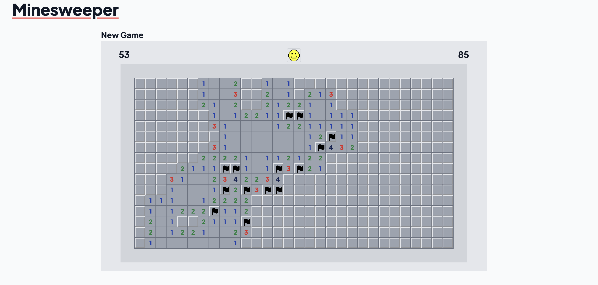

# Minesweeper

By Javier Carrillo

React app where you can play the classic Microsoft minesweeper game and see high-scores. Play at https://javiiicz.github.io/Minesweeper.

### Instructions:
The objective of the game is to decipher the location of all the mines in the field.
Click to reveal a cell or press space to flag it.
Cells with numbers hint at the number of mines in the eight cells adjacent to them.
You can do a "quick-reveal" by pressing space on a cell that has flags equal to its number of mines in its vicinity.
To restart the game, click the face at the top.

